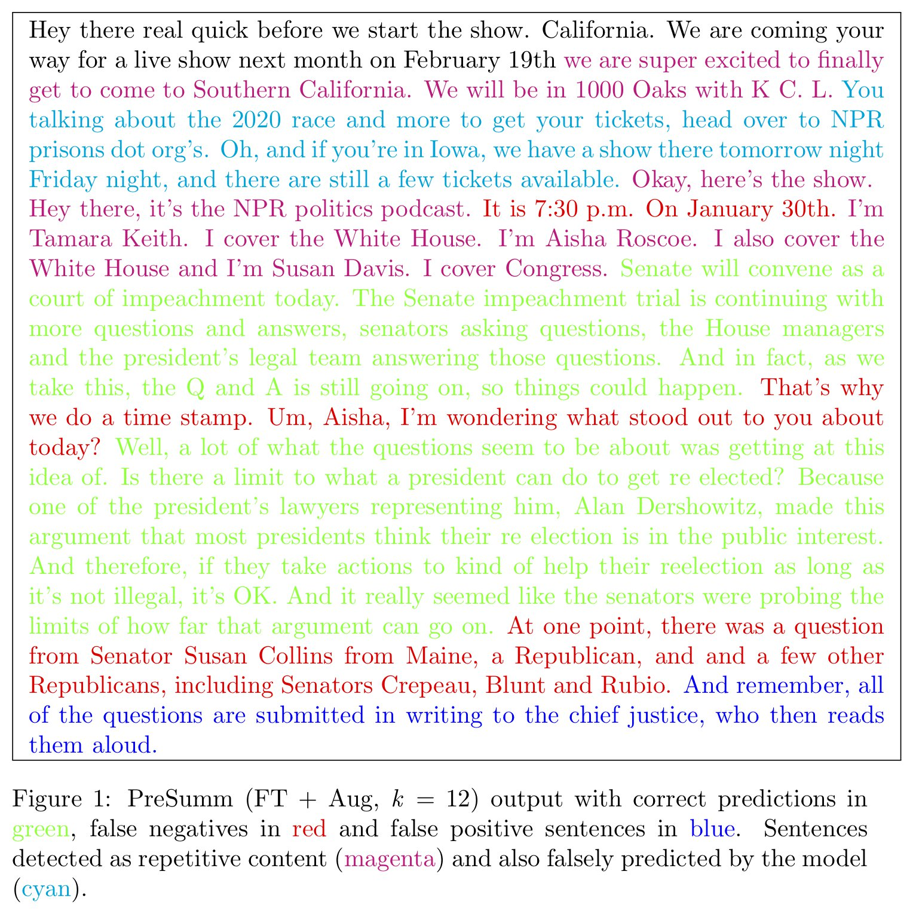
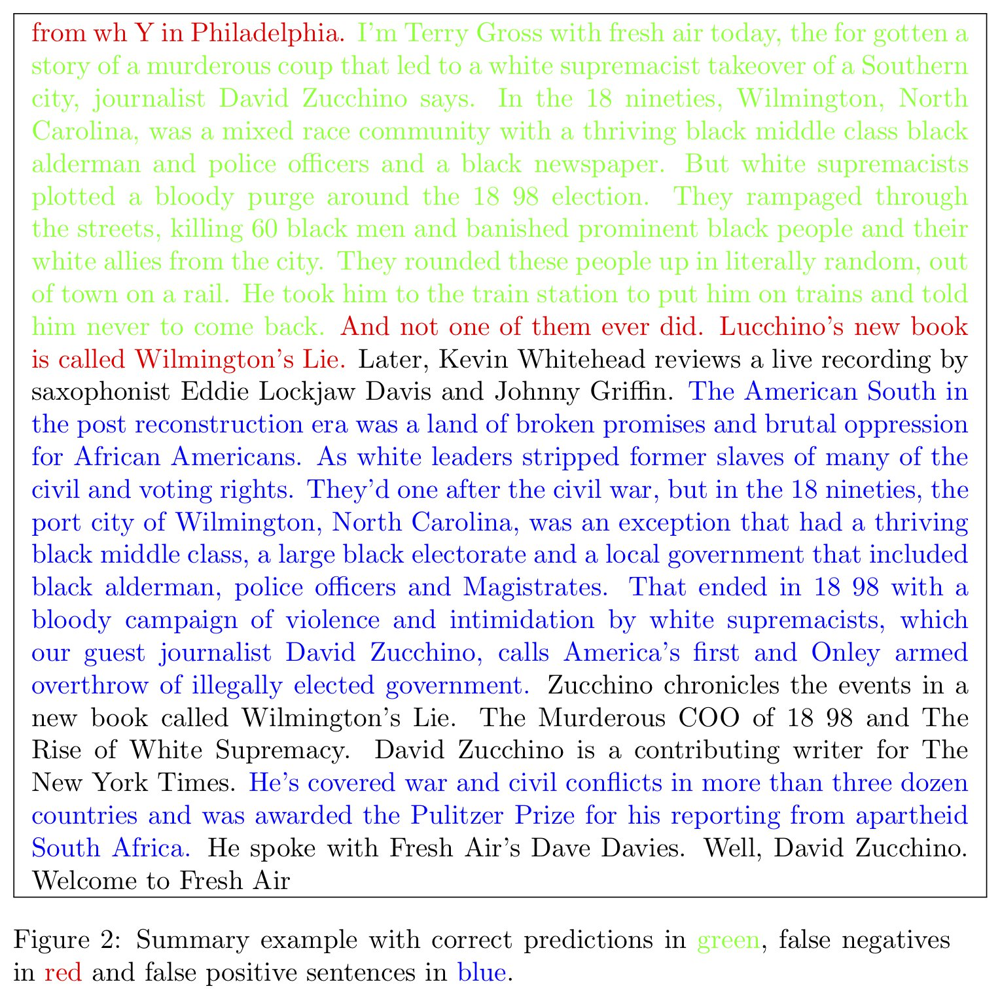

# Audio Summarization For Podcasts

_Aneesh Vartakavi, Amanmeet Garg, Zafar Rafii_, Gracenote

This page contains audio and visual examples from our paper titled, *Audio Summarization for Podcasts*.

> We propose a novel system for automatically generating audio summaries for podcasts, allowing listeners to have quick previews of podcast episodes. The proposed system first transcribes the audio from a podcast using automatic speech recognition (ASR), then summarizes the transcript using automatic extractive summarization, and finally returns the audio associated with the text summary. Motivated by a lack of datasets for this task, we created our own by transcribing the audio from various podcasts and summarizing the transcripts using a manual annotation tool. Using these text summaries, we fine-tuned a recent Transformer-based summarization model to specifically handle podcast summaries. Our system achieves ROUGE-(1/2/L) F-scores of 0.63/0.53/0.63, respectively, showing good performance for podcast summarization.

---
### Example 1

#### Audio Links
[Original]() |
[PreSumm (No FT)](./audio/PodSumm_1_no_ft.mp3) |
[PreSumm (FT + Aug)](./audio/PodSumm_1_ft.mp3)

---
### Example 2

#### Audio Links
[Original]() |
[PreSumm (No FT)](./audio/PodSumm_2_no_ft.mp3) |
[PreSumm (FT + Aug)](./audio/PodSumm_2_ft.mp3)

---
Gracenote, the Gracenote logo and logotype are either a registered trademark or a trademark of Gracenote, Inc. in the United States and/or other countries. © 2000-present. Gracenote, Inc. All rights reserved.  
